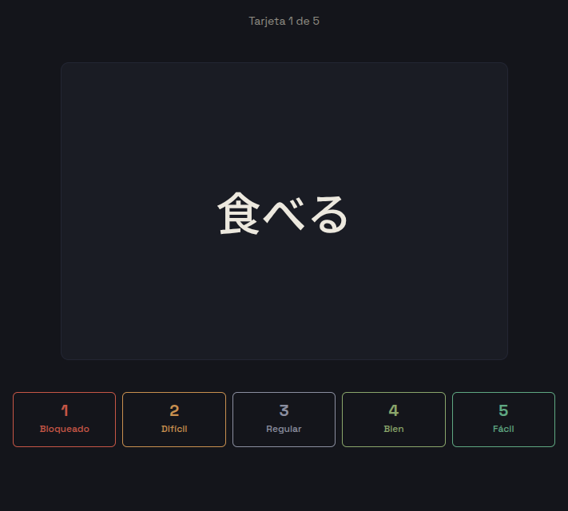

# Flashcards

App de flashcards con repetición espaciada que construí para estudiar japonés y frontend. Empezó como una herramienta de uso personal (algo que de verdad abro casi todos los días).

HTML, CSS y JavaScript vanilla. Sin frameworks, sin librerías, sin build step.

<!-- SCREENSHOT: captura principal (modo estudio o home). Sugerencia: img/05-study-front.png o un mockup desktop + móvil lado a lado -->


## Demo

🔗 **[Ver demo en vivo](https://flashcards-two-blue.vercel.app/#/)**

## Por qué existe

Quería una app de flashcards que funcionara como yo estudio, no como el promedio. Necesitaba repetición espaciada de verdad (que las tarjetas que me cuestan vuelvan pronto y las que domino se espacien) y necesitaba ver mi progreso: cuántos días llevo seguidos, qué tarjetas se me atascan, cómo viene la sesión.

Anki hace todo eso y más, pero su interfaz no me parecía cómoda, y nunca terminé de adueñarme de cómo funciona por dentro. Así que en lugar de pelearme con una herramienta que no entendía del todo, construí la mía.

## Features

- **Mazos por tema** con un color de acento personalizado para identificarlos de un vistazo.
- **Tarjetas con anverso y reverso** (front en japonés, back lectura/traducción; o concepto/definición para frontend).
- **Modo estudio** con animación de volteo 3D y una escala de confianza 1–5: **Bloqueado · Difícil · Regular · Bien · Fácil**. Bajo cada botón ves cuántos días se irá la tarjeta si eliges esa opción, al estilo Anki.
- **Algoritmo SM-2 adaptado**: la repetición espaciada ajusta los intervalos según tu confianza real, no según un calendario fijo.
- **Resumen post-sesión** con la distribución visual de cómo respondiste.
- **Vista de progreso**: historial de sesiones, tarjetas problemáticas y racha de días consecutivos estudiando.
- **Export / import en JSON** para backup y para llevar tus datos a otro dispositivo.
- **Dark mode** con paleta japonesa: tinta *sumi* en los fondos, papel *washi* en el texto, acento *shu* (rojo hanko) en lo importante.
- **Responsive**: funciona en móvil y desktop.

<!-- SCREENSHOT opcional: galería. Disponibles en img/: 01-home, 02-deck, 06-study-flipped, 07-summary, 08-progress -->

## Decisiones de arquitectura

Esta es la parte que más me importa de este README. Cada una de estas decisiones la tomé a conciencia, y aquí explico el porqué.

### Vanilla, sin frameworks

Quería entender la plataforma antes de apoyarme en una capa que la abstrae. React o Vue habrían resuelto el ruteo y el render por mí, pero también me habrían escondido cómo funcionan el DOM, el historial del navegador y el ciclo de vida de una vista. Para un proyecto cuyo objetivo paralelo era *aprender frontend de raíz*, esconder esas cosas era justo lo que no quería.

El resultado son ES modules nativos, sin bundler ni paso de compilación: el navegador carga `app.js` como `type="module"` y desde ahí cuelga todo. Lo que se despliega es exactamente lo que escribí.

### localStorage en 4 claves separadas, no un objeto gigante

Todo el estado vive bajo cuatro claves independientes en lugar de un único blob:

```
fc:meta      { schemaVersion, createdAt }
fc:decks     [ deck, … ]
fc:cards     [ card, … ]   ← array único; cada card lleva su deckId
fc:sessions  [ session, … ]  append-only
```

Separarlas tiene dos ventajas concretas. **Primero, no reescribo todo el dataset en cada cambio**: cuando actualizo una tarjeta solo serializo y persisto `fc:cards`, no los mazos ni el histórico de sesiones. **Segundo, la corrupción queda acotada a una clave.** `storage.js` envuelve cada `JSON.parse` en try/catch; si una clave se corrompe, se reinicializa vacía y la app sigue arrancando. Es mejor perder las sesiones que romper el arranque entero por un carácter mal escrito en otra clave.

`storage.js` es además el **único** módulo que toca localStorage, con política write-through: cada mutación persiste de inmediato, no hay caché en memoria que mantener sincronizado. El resto de la app no sabe que existe `localStorage`; solo llama a funciones como `createCard` o `getCardsByDeck`.

### SM-2 como funciones puras, probado en consola antes de la UI

El algoritmo de repetición espaciada vive en `srs.js` como funciones puras: **sin DOM, sin storage**. `schedule(srs, confidence, now)` recibe un estado y devuelve uno nuevo, nunca muta el original, y acepta `now` como parámetro inyectable para poder testear el paso del tiempo sin esperar días reales.

Construí y validé el algoritmo *antes* de escribir una sola línea de interfaz. La lógica de scheduling es el corazón de la app —si los intervalos están mal, todo lo demás da igual—, así que lo probé pegando casos en la consola del navegador: una tarjeta fácil (5, 5, 5) debe espaciarse, una difícil (2, 2, 3) debe colapsar a 1 día, el ease factor nunca debe perforar el piso de 1.3. Solo cuando la curva se comportó como esperaba, monté la UI encima. Esa prueba sigue documentada al final del archivo.

Hay una **divergencia deliberada del SM-2 canónico**: en el original, una respuesta "recordé con dificultad" (quality 3) *reduce* el ease factor. En esta app decidí que confianza 3 ("Regular") fuera neutral —acierto que hace crecer el intervalo pero no toca el ease factor— porque encaja mejor con cómo quiero que se sienta calificarse. Para eso reemplacé la fórmula canónica por una tabla de deltas anclada en `3 → 0`. Es la misma forma de curva, recentrada.

### `createElement` + `textContent`, nunca `innerHTML`

Todo el DOM se construye nodo a nodo con `createElement`, y el contenido de usuario se inserta siempre con `textContent`. No uso `innerHTML` en ninguna parte. Como el contenido de las tarjetas lo escribe el usuario, esto **resuelve el XSS de raíz**: no hay un punto donde una cadena se interprete como HTML, así que no hay nada que sanitizar ni una vulnerabilidad que se me pueda escapar más adelante. La seguridad no es un parche al final; es una propiedad de cómo está escrito el render.

### Tokens CSS en dos capas

El sistema de diseño está en `tokens.css` dividido en dos niveles:

- **Capa 1 — primitivas**: la paleta cruda. `--ink-1000`, `--paper-100`, `--shu-500`, la escala de confianza (`--aka`, `--kohaku`, `--nezumi`, `--wasabi`, `--matcha`). No se usan directamente en componentes.
- **Capa 2 — semánticos**: lo que los componentes sí consumen. `--bg`, `--surface-raised`, `--border-subtle`, `--text-…`, definidos *en términos de* las primitivas.

La separación me deja cambiar la apariencia sin tocar componentes. Si decido que los paneles sean un paso más claros, edito qué primitiva alimenta `--surface` y se propaga a toda la app. Los componentes nunca saben qué color exacto están usando, solo su rol semántico —y eso es justamente lo que dejaría una migración futura a tema claro como un cambio de una sola capa.

### `schemaVersion` y `migrate()` desde el día uno

`fc:meta` guarda un `schemaVersion`, y el arranque pasa todos los datos por un hook `migrate()` antes de usarlos. Hoy ese hook solo normaliza —garantiza que las cuatro piezas existan, descarta tarjetas inválidas, rellena slices que un backup editado a mano pudiera dejar fuera— y no hay saltos de versión todavía.

Lo construí desde el principio igual, porque la estructura de los datos *va* a cambiar (el roadmap incluye backend), y migrar datos de usuarios reales sin un mecanismo previsto es la clase de deuda que duele. El bucle de migración por versión ya está esbozado en el código, esperando el primer salto de esquema. Cuando llegue, los datos viejos no se rompen.

### Otros detalles

- **IDs con `crypto.randomUUID()`** y **timestamps en epoch ms** de forma consistente en todo el storage: sin colisiones y sin ambigüedad de zonas horarias.
- **Hash router hecho a mano** (`router.js`): `window.location.hash` + el evento `hashchange`, sin History API ni dependencias. Las vistas son funciones `render(container, param)` que el router invoca tras limpiar el contenedor.
- **Accesibilidad básica completa**: focus trap en los modales, roles ARIA correctos, navegación por teclado.

## Cómo correrlo localmente

La app usa **ES modules nativos**, que el navegador bloquea bajo el protocolo `file://`. Por eso **no funciona abriendo `index.html` directamente** con doble clic — necesitas servirlo desde un servidor local.

Con Python (no requiere instalar nada extra en la mayoría de sistemas):

```bash
python3 -m http.server 8000
```

O con Node:

```bash
npx serve
```

Luego abre `http://localhost:8000` (o el puerto que te indique `serve`) en el navegador. Eso es todo: no hay dependencias que instalar ni build que correr.

## Limitaciones conocidas y roadmap

**Los datos viven en el `localStorage` del dispositivo donde estudias.** No hay sincronización automática entre dispositivos: si estudio en la laptop y luego en el teléfono, son dos conjuntos de datos separados. El puente, por ahora, es el **export/import manual en JSON** — suficiente para backups y para mover datos de un equipo a otro a propósito, pero es un paso manual y lo sé.

La sincronización real está en el roadmap de la **V2**, que implica salir de `localStorage` y montar un backend:

- Backend con persistencia en servidor.
- Cuentas de usuario.
- Sincronización automática entre dispositivos.

El `schemaVersion` y el hook `migrate()` ya están puestos pensando justamente en esa transición.

## Autor

**Manuel Jauregui** — estudiante de análisis de sistemas (~5to semestre) en formación autodidacta de frontend. Este es uno de los proyectos principales de mi portafolio: lo construí para estudiar y usarlo personalmente.
